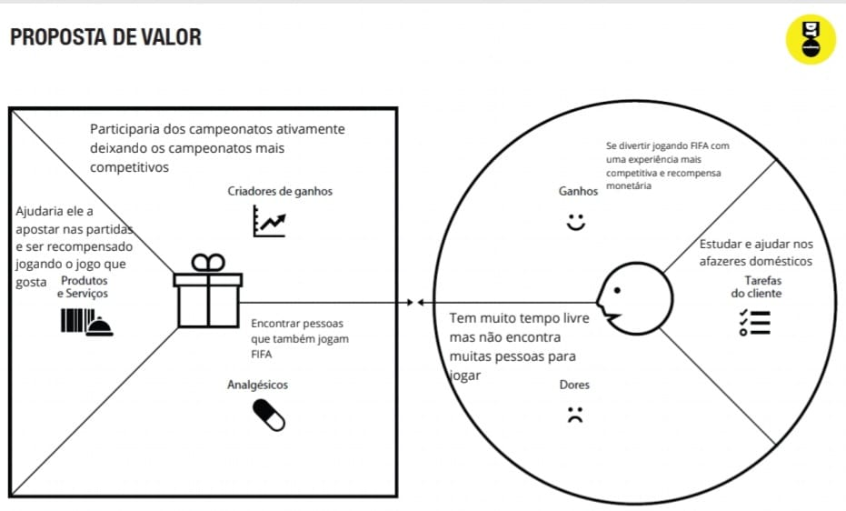

# Informações do Projeto
`Organizador de Campeonatos`  

`Ciência da Computação` 

## Participantes

> Os membros do grupo são: 
> - Gabriel Alves Bragança
> - Henrique Fialho Cardoso
> - Lucas Delgado Rocha
> - Mateus Soares Gatti Vasconcellos

# Estrutura do Documento

- [Informações do Projeto](#informações-do-projeto)
  - [Participantes](#participantes)
- [Estrutura do Documento](#estrutura-do-documento)
- [Introdução](#introdução)
  - [Problema](#problema)
  - [Objetivos](#objetivos)
  - [Justificativa](#justificativa)
  - [Público-Alvo](#público-alvo)
- [Especificações do Projeto](#especificações-do-projeto)
  - [Personas, Empatia e Proposta de Valor](#personas-empatia-e-proposta-de-valor)
  - [Histórias de Usuários](#histórias-de-usuários)
  - [Requisitos](#requisitos)
  - [Restrições](#restrições)
- [Projeto de Interface](#projeto-de-interface)
  - [User Flow](#user-flow)
  - [Wirefra[Org de camp 1.pdf](https://github.com/ICEI-PUC-Minas-PPLCC-TI/ti-1-ppl-cc-m2-20231-organizador-de-campeonato-1/files/11302042/Org.de.camp.1.pdf)
mes](#wireframes)
- [Metodologia](#metodologia)
  - [Divisão de Papéis](#divisão-de-papéis)
  - [Ferramentas](#ferramentas)
  - [Controle de Versão](#controle-de-versão)
- [**############## SPRINT 1 ACABA AQUI #############**](#-sprint-1-acaba-aqui-)
- [Projeto da Solução](#projeto-da-solução)
  - [Tecnologias Utilizadas](#tecnologias-utilizadas)
  - [Arquitetura da solução](#arquitetura-da-solução)
- [Avaliação da Aplicação](#avaliação-da-aplicação)
  - [Plano de Testes](#plano-de-testes)
  - [Ferramentas de Testes (Opcional)](#ferramentas-de-testes-opcional)
  - [Registros de Testes](#registros-de-testes)
- [Referências](#referências)

# Introdução

## Problema

>  O problema em questão é a dificuldade que pessoas possuem para criar campeonatos de Fifa de maneira online, devido a falta de uma plataforma que organiza e
>  encontra pessoas com o mesmo interesse.

## Objetivos

> O objetivo geral é desenvolver um site que organiza campeonatos de Fifa de uma forma simples e prática.
> Os objetivos específicos são criar campeonatos com premiações para os participantes e proporcionar uma experiência mais competitiva para os jogadores. 

## Justificativa

> O projeto teve como iniciativa criar um software devido a ausência de plataformas que organizam o campeonatos do jogo Fifa.
> É possível observar que em outros jogos plataformas semelhantes estão funcionando com êxito, o que nós motiva a implementar
> essa plataforma para o jogo de futebol Fifa, um dos jogos online da sua categoria mais famosos e jogado.

## Público-Alvo

> O público-alvo são pessoas que possuem tempo livre e estão dispostas a jogar campeonatos de Fifa. Essas pessoas
> no geral possuem console (Xbox ou Playstation), são jovens que estão estudando ou começando a trabalhar. Em sua maioria
> são homens e que tem acesso a uma internet boa e estável.
 
# Especificações do Projeto

> Nas especificações será abordado sobre as personas, proposta de valor, histórias de usuários e requisitos funcionais e não funcionais.
> As ferramentas utilizads para realizar o projeto foram a plataforma do Miro e Github.

## Personas, Empatia e Proposta de Valor

>  As semelhanças das personas do projeto são homens, estudantes, jovens que gostam de futebol e videogames.
>  Todos possuem console, celular e computador e têm como objetivo encontrar amigos para jogar junto e se divertir.
>  No geral eles precisam estudar ou trabalhar. Se estão estudando possuem mais tempo livre do que trabalhando. Ambos querem encontrar uma nova maneira para jogar
>  e poderiam fazer isso atrvés do site.
> 
> **Personas**
> 
> 
> 
> 
> 
>
> **Proposta de Valor**
> 
> 
> 

## Histórias de Usuários

Com base na análise das personas forma identificadas as seguintes histórias de usuários:

|EU COMO... `PERSONA`| QUERO/PRECISO ... `FUNCIONALIDADE` |PARA ... `MOTIVO/VALOR`                 |
|--------------------|------------------------------------|----------------------------------------|
|Usuário             | Personalizar meu perfil              | Poder se destacar e mostrar minhas habilidades e conquistas    |
|Administrador       | Visualizar relatórios de atividades  | Poder gerenciar e monitorar o site |
|Usuário             | Poder conversar com outros jogadores | Trocar dicas e estratégias, e conhecer novas pessoas|
|Administrador       | Alterar permissões                   | Permitir que outros usuários possam administrar contas|
|Usuário             | Depositar e retirar dinheiro do site | Poder fazer apostas e receber meus prêmios|

## Requisitos

As tabelas que se seguem apresentam os requisitos funcionais e não funcionais que detalham o escopo do projeto.

### Requisitos Funcionais

|ID    | Descrição do Requisito  | Prioridade |
|------|-----------------------------------------|----|
|RF-001| Permitir que o usuário se inscreva no torneio | ALTA | 
|RF-002| Permitir que os usuários pesquisem por campeonatos em andamento ou próximos que eles possam querer participar| MÉDIA |
|RF-003| Possibilitar que os usuários criem um perfil e personalizem suas informações, incluindo seus nomes, fotos e informações sobre suas habilidades no jogo | ALTA |
|RF-004| Permitir que os usuários se comuniquem uns com os outros através de um sistema de mensagens dentro do site.| MÉDIA |
|RF-005| Oferecer a opção de jogos individuais ou em equipe, permitindo que os usuários escolham jogar sozinhos ou com amigos | BAIXA |

### Requisitos não Funcionais

|ID     | Descrição do Requisito  |Prioridade |
|-------|-------------------------|----|
|RNF-001| Certificar-se de que o site seja compatível com vários navegadores e dispositivos, para que os usuários possam acessá-lo de qualquer lugar| ALTA | 
|RNF-002| Assegurar que o site seja escalável, para que possa lidar com um grande número de usuários simultâneos e cresça com o tempo |  MÉDIA | 
|RNF-003| Garantir a privacidade dos usuários, protegendo suas informações e dados pessoais | ALTA |

## Restrições

O projeto está restrito pelos itens apresentados na tabela a seguir.

|ID| Restrição                                             |
|--|-------------------------------------------------------|
|01| O projeto deverá ser entregue até o final do semestre |
|02| Não pode ser desenvolvido um módulo de backend        |

# Projeto de Interface

...... INTRODUÇÃO À INTERFACE DO PROJETO ......
> As interfaces do site foram criadas de modo que atenda as necessidades dos usuários
> vistas nas entrevistas, na página inicial é apresentado os principais campeonatos do 
> site, de modo que o usuário clique e consiga se inscrever, também tem um espaço para 
> criação de contas, e para o usuário criar seu próprio campeonato com seus amigos, depois
> da tela de criação de campeonatos há o chaveamento do campeonato, restrito em até as oitavas
> de finais, dessa forma o usuário poderá vizualizar o andamento da competição.

## User Flow

...... FLUXO DO USUÁRIO NA APLICAÇÃO ......

> 

## Wireframes

......  INCLUA AQUI OS WIREFRAMES DAS TELAS DA APLICAÇÃO COM UM BREVE DESCRITIVO ......

> Wireframes são protótipos das telas da aplicação usados em design de interface para sugerir a
> estrutura de um site web e seu relacionamentos entre suas
> páginas. Um wireframe web é uma ilustração semelhante ao
> layout de elementos fundamentais na interface.
> 
> **Links Úteis**:
> - [Ferramentas de Wireframes](https://rockcontent.com/blog/wireframes/)
> - [Figma](https://www.figma.com/)
> - [Adobe XD](https://www.adobe.com/br/products/xd.html#scroll)
> - [MarvelApp](https://marvelapp.com/developers/documentation/tutorials/)
> 
> **Exemplo**:
> 
>  
> **Página Inicial**:
> 
> Nessa página será mostrado a logo do site, botões de navegação, principais campeonatos disponíveis
> no momento, um carrousel com imagens ilustrativas e os resultados dos campeonatos anteriores do usuário.
> **Login**:
> 
> Nessa página será feito o login do usuário.
> **Sign up**:
> 
> Essa página é destinada a novos usuários que não possuem conta na aplicação.
> **Criar campeonato**
> 
> Nessa página o usuário criará seu campeonato e adicionará os participantes.
> **Chaveamento**
> 
> Nessa página o usuário irá vizualizar o andamento da competição.

# Metodologia

## Divisão de Papéis

> -Miro: Todos os integrantes ajudaram na montagem.
> -Relatorio: Lucas e Mateus.
> -WireFrame: Gabriel e Henrique.
> -Apresentação: Todos participaram.

## Ferramentas

......  COLOQUE AQUI O SEU TEXTO - SIGA O EXEMPLO DA TABELA ABAIXO  ......

| Ambiente  | Plataforma              |Link de Acesso |
|-----------|-------------------------|---------------|
|Processo de Design Thinkgin  | Miro |  https://miro.com/app/board/uXjVMYCb9Uk=/?share_link_id=946364279832 |
|Repositório de código | GitHub | https://github.com/ICEI-PUC-Minas-PPLCC-TI/ti-1-ppl-cc-m2-20231-organizador-de-campeonato-1.git | 
|Hospedagem do site | Heroku |  https://XXXXXXX.herokuapp.com | 
|Protótipo Interativo | MavelApp ou Figma | https://www.figma.com/files/team/1230259766516332694/Organizador-de-Campeonatos?fuid=1230281308124788490 | 

> As ferramentas empregadas no projeto são:
> 
> - Vscode
> - WhatsApp
> - Discord
> - Miro
> - Figma
> - GitHub
> 
> O editor de código foi escolhido porque ele possui uma integração com o
> sistema de versão. As ferramentas de comunicação utilizadas possuem
> integração semelhante e por isso foram selecionadas. Por fim, para criar
> diagramas utilizamos essa ferramenta por melhor captar as
> necessidades da nossa solução.

## Controle de Versão

......  COLOQUE AQUI O SEU TEXTO ......

> Discuta como a configuração do projeto foi feita na ferramenta de
> versionamento escolhida. Exponha como a gerência de tags, merges,
> commits e branchs é realizada. Discuta como a gerência de issues foi
> realizada.
> A ferramenta de controle de versão adotada no projeto foi o
> [Git](https://git-scm.com/), sendo que o [Github](https://github.com)
> foi utilizado para hospedagem do repositório `upstream`.
> 
> O projeto segue a seguinte convenção para o nome de branchs:
> 
> - `master`: versão estável já testada do software
> - `unstable`: versão já testada do software, porém instável
> - `testing`: versão em testes do software
> - `dev`: versão de desenvolvimento do software
> 
> Quanto à gerência de issues, o projeto adota a seguinte convenção para
> etiquetas:
> 
> - `bugfix`: uma funcionalidade encontra-se com problemas
> - `enhancement`: uma funcionalidade precisa ser melhorada
> - `feature`: uma nova funcionalidade precisa ser introduzida
>
> **Links Úteis**:
> - [Tutorial GitHub](https://guides.github.com/activities/hello-world/)
> - [Git e Github](https://www.youtube.com/playlist?list=PLHz_AreHm4dm7ZULPAmadvNhH6vk9oNZA)
> - [5 Git Workflows & Branching Strategy to deliver better code](https://zepel.io/blog/5-git-workflows-to-improve-development/)
>
> **Exemplo - GitHub Feature Branch Workflow**:
>
> 

# **############## SPRINT 1 ACABA AQUI #############**

# Projeto da Solução

......  COLOQUE AQUI O SEU TEXTO ......

## Tecnologias Utilizadas

......  COLOQUE AQUI O SEU TEXTO ......

> Descreva aqui qual(is) tecnologias você vai usar para resolver o seu
> problema, ou seja, implementar a sua solução. Liste todas as
> tecnologias envolvidas, linguagens a serem utilizadas, serviços web,
> frameworks, bibliotecas, IDEs de desenvolvimento, e ferramentas.
> Apresente também uma figura explicando como as tecnologias estão
> relacionadas ou como uma interação do usuário com o sistema vai ser
> conduzida, por onde ela passa até retornar uma resposta ao usuário.
> 
> Inclua os diagramas de User Flow, esboços criados pelo grupo
> (stoyboards), além dos protótipos de telas (wireframes). Descreva cada
> item textualmente comentando e complementando o que está apresentado
> nas imagens.

## Arquitetura da solução

......  COLOQUE AQUI O SEU TEXTO E O DIAGRAMA DE ARQUITETURA .......

> Inclua um diagrama da solução e descreva os módulos e as tecnologias
> que fazem parte da solução. Discorra sobre o diagrama.
> 
> **Exemplo do diagrama de Arquitetura**:
> 
> 

# Avaliação da Aplicação

......  COLOQUE AQUI O SEU TEXTO ......

> Apresente os cenários de testes utilizados na realização dos testes da
> sua aplicação. Escolha cenários de testes que demonstrem os requisitos
> sendo satisfeitos.

## Plano de Testes

......  COLOQUE AQUI O SEU TEXTO ......

> Enumere quais cenários de testes foram selecionados para teste. Neste
> tópico o grupo deve detalhar quais funcionalidades avaliadas, o grupo
> de usuários que foi escolhido para participar do teste e as
> ferramentas utilizadas.
> 
> **Links Úteis**:
> - [IBM - Criação e Geração de Planos de Teste](https://www.ibm.com/developerworks/br/local/rational/criacao_geracao_planos_testes_software/index.html)
> - [Práticas e Técnicas de Testes Ágeis](http://assiste.serpro.gov.br/serproagil/Apresenta/slides.pdf)
> -  [Teste de Software: Conceitos e tipos de testes](https://blog.onedaytesting.com.br/teste-de-software/)

## Ferramentas de Testes (Opcional)

......  COLOQUE AQUI O SEU TEXTO ......

> Comente sobre as ferramentas de testes utilizadas.
> 
> **Links Úteis**:
> - [Ferramentas de Test para Java Script](https://geekflare.com/javascript-unit-testing/)
> - [UX Tools](https://uxdesign.cc/ux-user-research-and-user-testing-tools-2d339d379dc7)

## Registros de Testes

......  COLOQUE AQUI O SEU TEXTO ......

> Discorra sobre os resultados do teste. Ressaltando pontos fortes e
> fracos identificados na solução. Comente como o grupo pretende atacar
> esses pontos nas próximas iterações. Apresente as falhas detectadas e
> as melhorias geradas a partir dos resultados obtidos nos testes.

# Referências

......  COLOQUE AQUI O SEU TEXTO ......

> Inclua todas as referências (livros, artigos, sites, etc) utilizados
> no desenvolvimento do trabalho.
> 
> **Links Úteis**:
> - [Formato ABNT](https://www.normastecnicas.com/abnt/trabalhos-academicos/referencias/)
> - [Referências Bibliográficas da ABNT](https://comunidade.rockcontent.com/referencia-bibliografica-abnt/)
